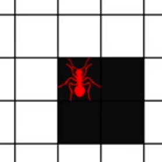
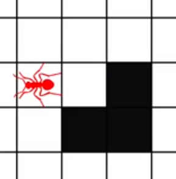
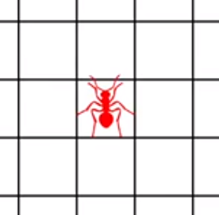

# La fourmi de Langton - étape 7, avec quelques mouvements !

## Les explications

Nous y voilà ! Nous voulions qu'une fourmi inverse la couleur de sa case... ça, c'est fait !

Mais nous voulions en fait qu'elle respecte les règles suivantes :

- Si la case sous la fourmi est coloriée, elle efface la couleur de cette case, puis elle part à sa gauche (en avançant d'une seule case).


- Si la case sous la fourmi n'est pas coloriée, elle colorie cette case, puis elle part à sa droite (en avançant d'une seule case) ;



La programmation de ces mouvements dépendent de l'orientation de la fourmi (p. ex. si elle regarde vers le haut, "partir à sa gauche" n'aura pas le même résultat que si elle regarde vers le bas) et c'est un peu trop complexe à gérer pour cet atelier.

Le code qui permet de gérer cela a donc déjà été écrit grâce à 2 *fonctions*.

En programmation, une fonction permet de lancer l'exécution de certaines instructions qu'on n'aura plus besoin de réécrire explicitement.

Par exemple, plutôt que d'écrire une longue séquence d'instruction du type :

- Attrape la poignée de la porte !
- Tourne la poignée !
- Ramène ton bras vers toi !
- Lâche la poignée !

Je pourrai simplement écrire :
- Ouvre la porte !

Il faut bien sûr, pour que ça marche, que la fonction ait été définie préalablement. Et cela a été fait de telle sorte que nous pourrons donc dire à la fourmi de "tourner d'un quart de tour vers sa gauche, puis avancer !" via la fonction :

```C
ant_turns_left_then_move();
```

Et nous pourrons également dire à la fourmi de "tourner d'un quart de tour vers sa droite, puis avancer !" via la fonction :

```C
ant_turns_right_then_move();
```

NB : Cette écriture peut faire penser à des instructions. C'est normal car en programmation, lorsqu'on utilise une fonction, c'est considéré comme une instruction ! Et d'autre part, toutes les instructions que nous avons utilisées jusqu'ici (`init_paper();`, `move_to();`, ...) sont des fonctions que nous utilisons.

<br />

## Les consignes de notre mission

**Nous avions un programme qui nous permettait d'effacer ou colorier une même case plusieurs fois.**

**Nous devons maintenant préciser que :<br />
Si la case est coloriée :**
 1) ** On l'efface, puis **
 2) ** On tourne la fourmi d'un quart de tour vers sa gauche et on la fait avancer d'une case  !<br />
Sinon (donc si la case n'est pas coloriée) : **
 1) ** On la colorie, puis **
 2) ** On tourne la fourmi d'un quart de tour vers sa droite et on la fait avancer d'une case  !**

<br />

## Alerte au piège !

**Bien respecter l'ordre des opérations :**<br />
**1) Créer le Paper animé ;**<br />
**2) Se déplacer sur la case du milieu ;**<br />
**3) REPETER 8 FOIS : SI la case est coloriée, on l'efface et la fourmi part à sa gauche SINON, on la colorie et le fourmi part à sa droite ;**<br />
**4) Afficher le Paper animé.**

<br />

## Le programme C (à vous les commandes !)

**! N'hésitez pas à revenir en arrière et copier-coller ci-dessous votre programme précédent avant de le modifier.**

@[fourmi1]({"stubs": ["main.c"],"command": "sh /project/target/run.sh", "project" : "fourmi1"})

Si tout est bon, on constate que la fourmi trace son chemin en respectant le petit dessin montré dans la vidéo d'introduction :


La logique à suivre par la fourmi est maintenant programmée, ne nous reste plus qu'à tester avec une plus grande surface de Paper animé (en quelque sorte "dézoomer") et en augmentant le nombre de mouvements.