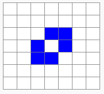

# La fourmi de Langton - étape 8, dézoom et comportement symétrique (472 étapes) !

## Les explications

Pour voir le comportement symétrique de notre fourmi, nous allons :
1) Agrandir le Paper animé dans lequel elle se balade ;
1) Diminuer la taille des cases pour ne pas avoir un Paper trop grand (d'où l'effet de "dézoom") ;
1) Accélérer la vitesse de l'animation ;
 
 Tout cela pourra se faire en modifiant les valeurs de paramètres de l'instruction `init_paper();`

Pour rappel :

```C
init_paper(nb_lignes, nb_colonnes, taille, delai_anim, ctrl_les_pas); 
```
est une instruction qui permet de créer et paramétrer un Paper animé.

- `nb_lignes` est un premier *paramètre*, c'est un nombre entier qui donne le nombre de lignes du Paper
- `nb_colonnes` est un deuxième paramètre (nombre entier) qui donne le nombre de colonnes du Paper
- `taille` donne la dimension en pixels d'une case du Paper (p. ex. 25 pour un Paper dont chaque case mesure 25 pixels de côtés)
-  `delai_anim` est le temps de pause (en secondes) entre chaque coloriages ou effacements de cases. Ceci permet de contrôler la vitesse de l'animation. Ce délai peut-être un nombre décimal, par exemple 0.05 pour 5 centièmes de seconde.
-  Nous ne nous préoccuperons pas du paramètre `ctrl_les_pas`, il devra être mis à 0.

Mais en modifiant la taille du Paper, notre fourmi, pour rester au départ au milieu de celui-ci, doit se déplacer au bon endroit dans le Paper (juste après sa création).

Nous devrons donc adapter les valeurs de paramètres de l'instructions `move_to();`

Pour rappel :

```C
move_to(ligne, colonne); 
```
est une instruction qui permet de déplacer le curseur dans le Paper.

- `ligne` est un premier paramètre, c'est un nombre entier qui donne le numéro de la ligne du Paper à atteindre
- `colonne` est un deuxième paramètre (nombre entier) qui donne le numéro de la colonne à atteindre. 

Nous allons également bien entendu augmenter le nombre de répétitions, cela se fera très simplement en modifiant la valeur de 'n' dans notre boucle.

Pour rappel :

```C
repeat (n) {
   instructions_exécutées_n_fois
} loop;
```

Cette écriture permet de faire répéter plusieurs fois l'exécution d'un certain nombre d'instructions.

- `n` est le nombre de répétitions
- `instructions_exécutées_n_fois` est une série d'instructions qui seront répétées exactement n fois.

<br />

## Les consignes de notre mission

Nous avions une fourmi de Langton qui a effectué correctement :
- 8 étapes ;
- Dans un petit Paper de 7x7 ;
- Avec des cases de 25 pixels de côtés ;
- Avec un délai de pause entre chaque étape de l'animation de 0.5s ;
- Et un curseur (notre fourmi) initialement positionné en 4e ligne, 4e colonne.

Nous devons maintenant obtenir une fourmi de Langton qui va effectuer correctement :
- 472 étapes ;
- Dans un Paper de 15x15 ;
- Avec des cases de 15 pixels de côtés ;
- Avec un délai de pause entre chaque étape de l'animation de 0.25s ;
- Et un curseur (notre fourmi) initialement positionné en 8e ligne, 8e colonne.
<br />

## Alerte au piège !

**Bien respecter l'ordre des opérations :**<br />
**1) Créer le Paper animé ;**<br />
**2) Se déplacer sur la case du milieu ;**<br />
**3) REPETER 8 FOIS : SI la case est coloriée, on l'efface et la fourmi par à sa gauche SINON, on la colorie et le fourmi part à sa droite ;**<br />
**4) Afficher le Paper animé.**

<br />

## Le programme C (à vous les commandes !)

**! N'hésitez pas à revenir en arrière et copier-coller ci-dessous votre programme précédent avant de le modifier.**

@[fourmi1]({"stubs": ["main.c"],"command": "sh /project/target/run.sh", "project" : "fourmi1"})

Si tout est bon, on constate que la fourmi trace son chemin en respectant le petit dessin montré dans la vidéo d'introduction :



La logique à suivre par la fourmi est maintenant programmée, ne nous reste plus qu'à tester avec une plus grande surface de Paper animé (en quelque sorte "dézoomer") et en augmentant le nombre d'étapes.
